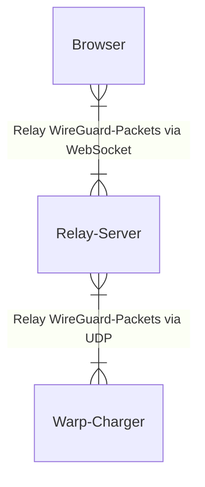
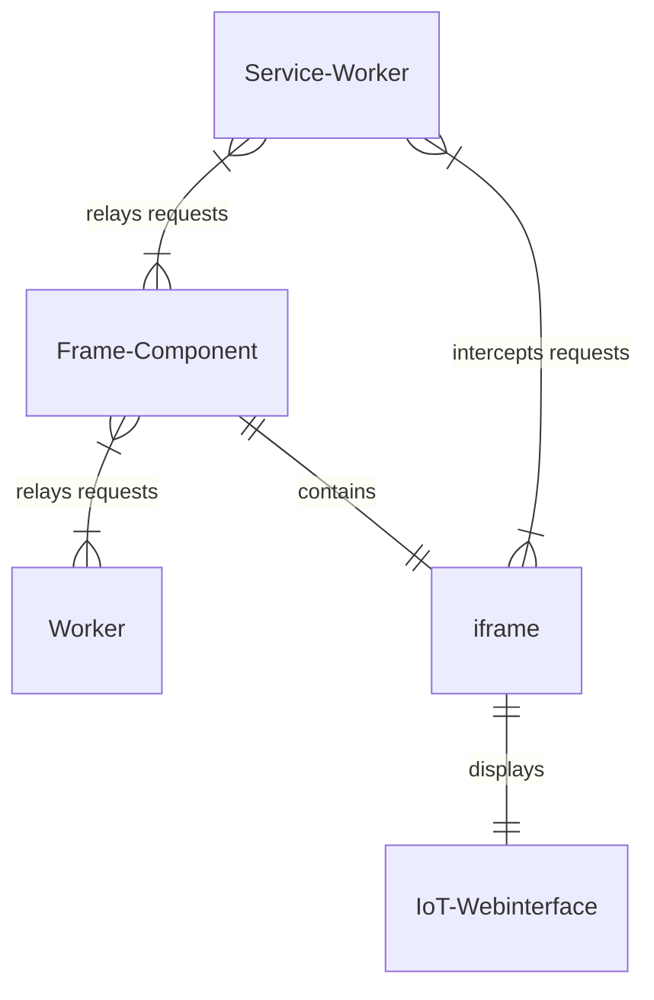
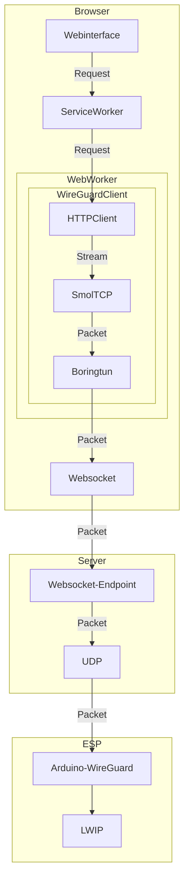

# Entity relations

### General Concept

```mermaid
erDiagram
    Browser }|--|{ Relay-Server: "Relay WireGuard-Packets via WebSocket"
    Relay-Server }|--|{ Warp-Charger: "Relay WireGuard-Packets via UDP"
```

### Inner concstruction in browser

```mermaid
erDiagram
    Frame-Component }|--|{ Worker: "relays requests"
    Frame-Component ||--|| iframe: contains
    iframe ||--|| IoT-Webinterface: displays
    Service-Worker }|--|{ iframe: "intercepts requests"
    Service-Worker }|--|{ Frame-Component: "relays requests"
```

### Flow of data

```mermaid
flowchart
    subgraph Browser
    ServiceWorker -- Request --> HTTPClient
    Webinterface -- Request --> ServiceWorker
    subgraph WebWorker
    subgraph WireGuardClient
    HTTPClient -- Stream --> SmolTCP
    SmolTCP -- Packet --> Boringtun
    end
    end
    Boringtun -- Packet --> Websocket
    end

    subgraph Server
    Websocket -- Packet --> Websocket-Endpoint
    Websocket-Endpoint -- Packet --> UDP
    end

    subgraph ESP
    UDP -- Packet --> Arduino-WireGuard
    Arduino-WireGuard --> LWIP
    end
```
