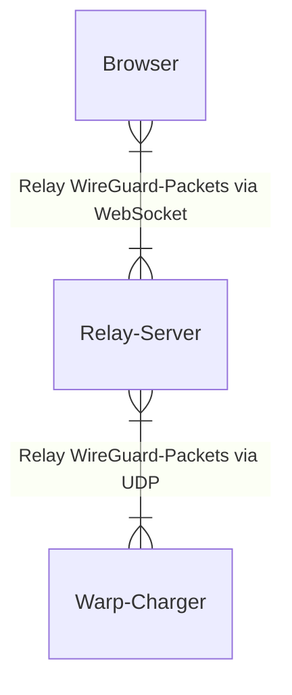
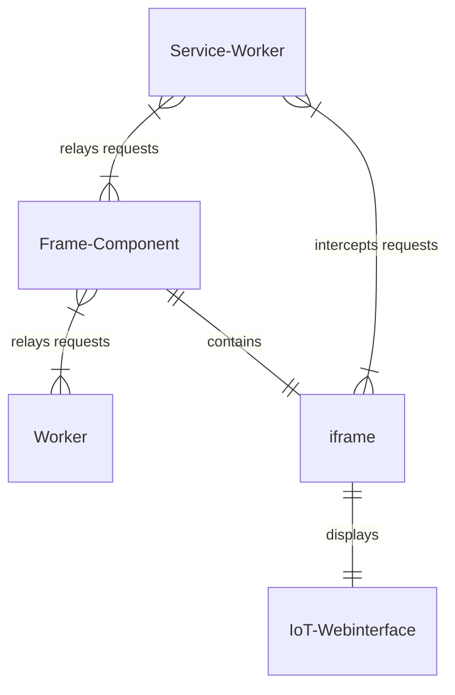

# Entity relations

### General Concept

```mermaid
erDiagram
    Browser }|--|{ Relay-Server: "Relay WireGuard-Packets via WebSocket"
    Relay-Server }|--|{ Warp-Charger: "Relay WireGuard-Packets via UDP"
```

### Inner concstruction in browser

```mermaid
erDiagram
    Frame-Component }|--|{ Worker: "relays requests"
    Frame-Component ||--|| iframe: contains
    iframe ||--|| IoT-Webinterface: displays
    Service-Worker }|--|{ iframe: "intercepts requests"
    Service-Worker }|--|{ Frame-Component: "relays requests"
```
