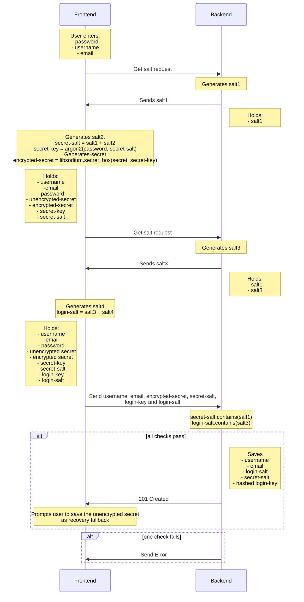
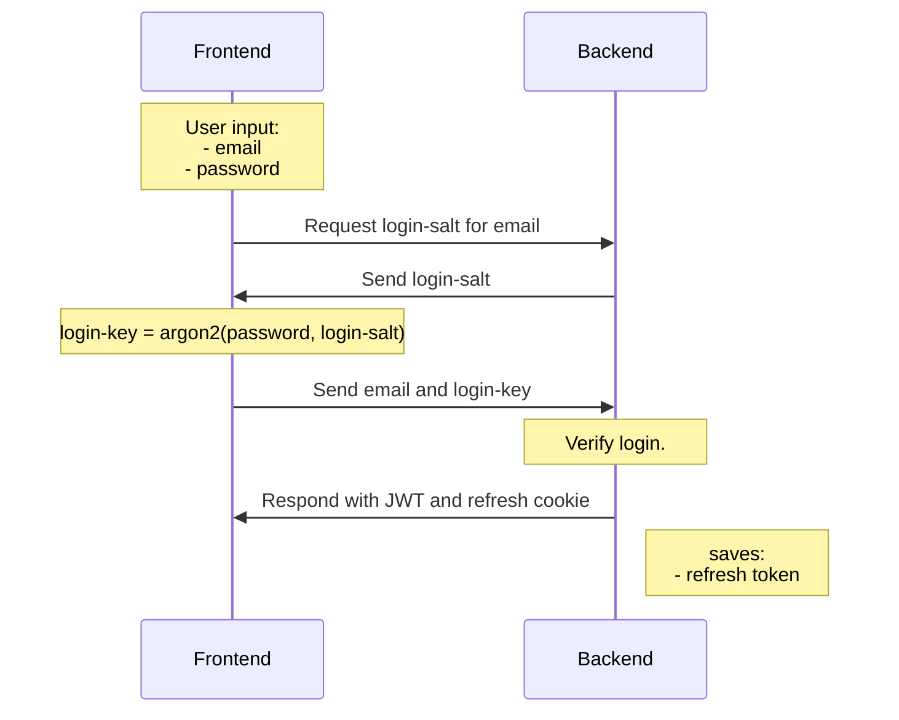
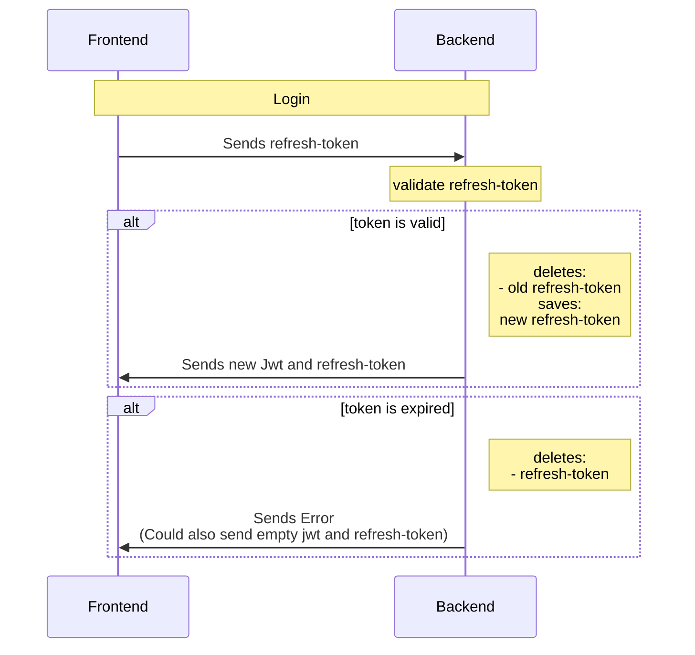
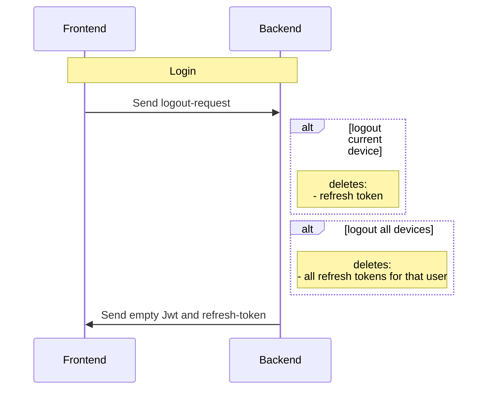
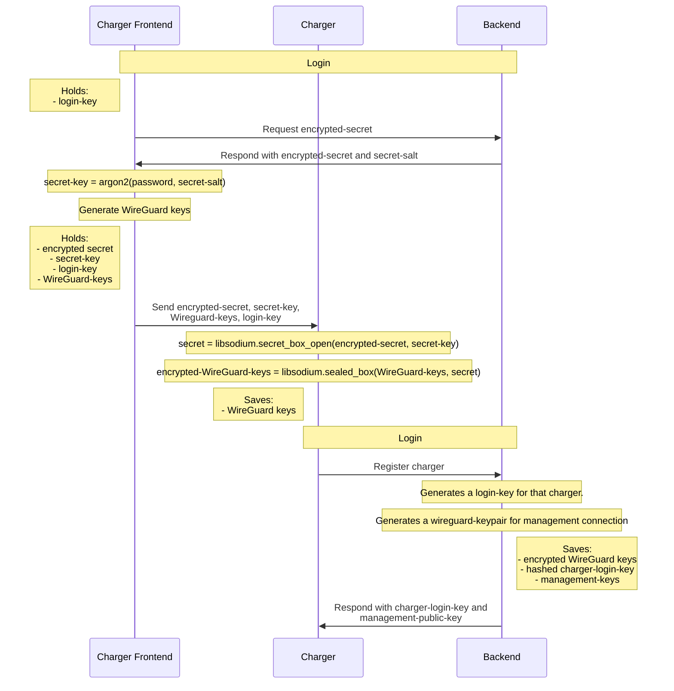
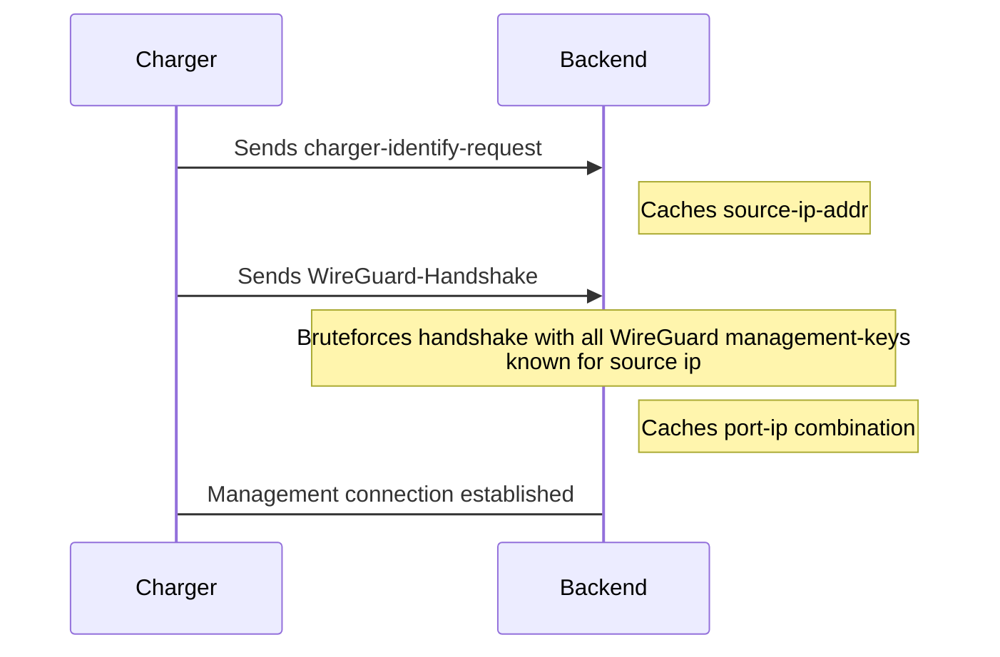
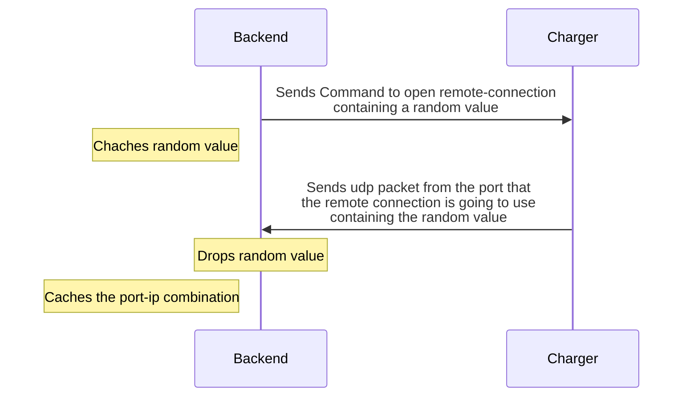
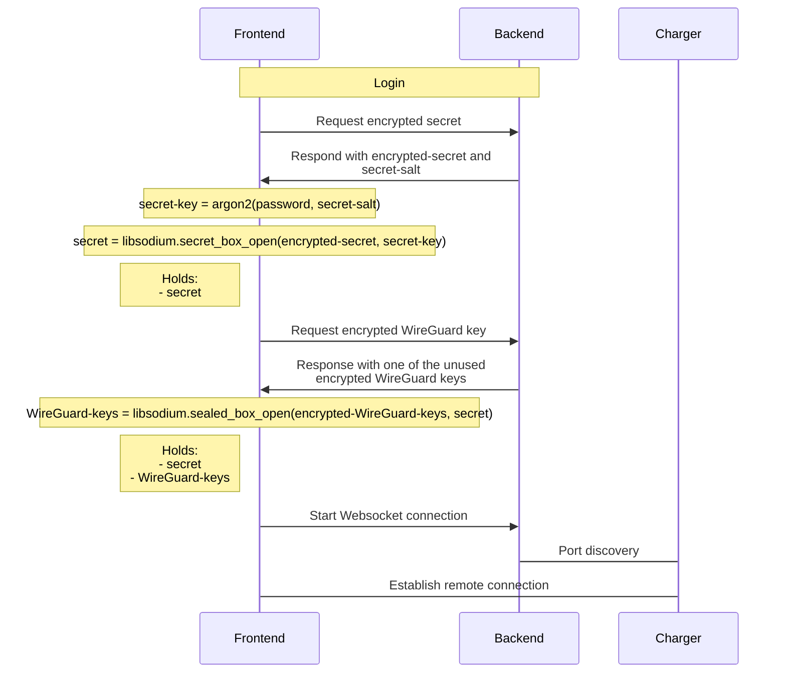
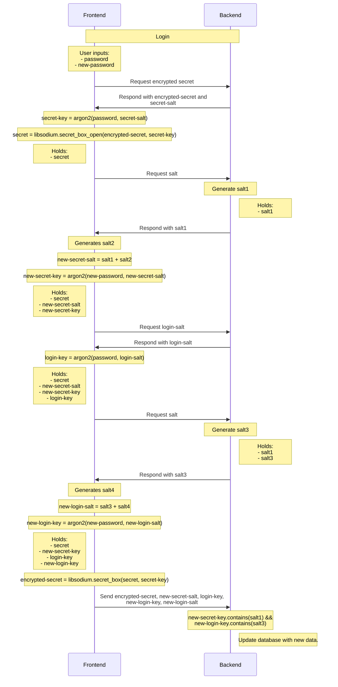
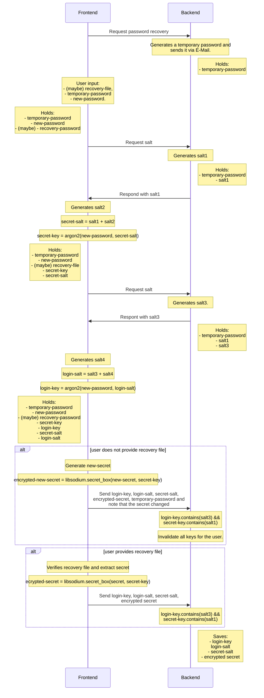

# Sequence Diagram

### Registration
When beginning no data is stored anywhere.

When ending the backend stores the Encrypted username, key, email, salts and secret.

### Login

When beginning the Backend has stored the encrypted Username, key, email, salts and secret.

When ending no additional data is stored on the backend and the frontend stores a JWT cookie.

### Refresh Jwt Token

### Logout

### Add charger

When beginning the Backend has stored the encrypted Username, login-key, email, salts and secret.

When ending the backend additionally stores the encrypted wireguard keys and the charger stores the unencrypted secret, login-key and WireGuard keys.

### Establish management connection

### Port discovery

### Connect to charger

When beginning the Backend has stored the encrypted Username, login-key, email, salts and secret.

When ending no additional data is stored on the backend

### Change password

### Password recovery

